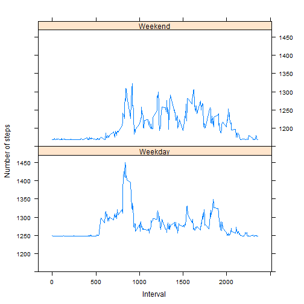

#Reproducible Research: Peer Assessment 1
####Author: Kalyan Nandi
####Date: Thursday, September 11, 2015

## Loading and preprocessing the data


```r
#Load the data (i.e. read.csv())
data <- read.csv("D:/Coursera/Reproducible Research/repdata-data-activity/activity.csv")

#Process/transform the data (if necessary) into a format suitable for your analysis
summary(data$interval)
```

```
##    Min. 1st Qu.  Median    Mean 3rd Qu.    Max. 
##     0.0   588.8  1178.0  1178.0  1766.0  2355.0
```

##What is mean total number of steps taken per day?

```r
data.perday <- aggregate(data[1], by=data[2],FUN=sum,na.rm=TRUE)
#1. Calculate the total number of steps taken per day
head(data.perday)
```

```
##         date steps
## 1 2012-10-01     0
## 2 2012-10-02   126
## 3 2012-10-03 11352
## 4 2012-10-04 12116
## 5 2012-10-05 13294
## 6 2012-10-06 15420
```


```r
#2. If you do not understand the difference between a histogram and a barplot, research the difference #between them. Make a histogram of the total number of steps taken each day
hist(data.perday$steps,
     main="total number of steps taken each day",
     xlab="steps",
     ylab="Number of Steps",
     breaks=30,
     col="seagreen")
```

 


```r
#3. mean total number of steps taken per day
mean(data.perday$steps, na.rm=TRUE)
```

```
## [1] 9354.23
```

```r
#3. median total number of steps taken per day
median(data.perday$steps , na.rm = TRUE)
```

```
## [1] 10395
```

##What is the average daily activity pattern?


```r
#1.Make a time series plot (i.e. type = "l") of the 5-minute interval (x-axis) and the average number of #steps taken, averaged across all days (y-axis)

data.interval <- aggregate(data[1],by=data[3],FUN=mean,na.rm=TRUE)
plot(x=data.interval$interval,
     y=data.interval$steps,
     type="l",
     main="Average Steps Per 5-Minute Interval",
     xlab="Interval",
     ylab="Number of Steps",
     col= "blue")
```

 


```r
#2. Which 5-minute interval, on average across all the days in the dataset, contains the maximum #number of steps?
max_interval <- data.interval[data.interval$steps==max(data.interval$steps),][[1]]
max_interval
```

```
## [1] 835
```

#Imputing missing values

```r
#1. Calculate and report the total number of missing values in the dataset (i.e. the total number of #rows with NAs)

nrow(data[is.na(data$steps),])
```

```
## [1] 2304
```

```r
#or
sum(is.na(data$steps))
```

```
## [1] 2304
```

```r
#2. Devise a strategy for filling in all of the missing values in the dataset. The strategy does not #need to be sophisticated. For example, you could use the mean/median for that day, or the mean for #that 5-minute interval, etc.
library(plyr)
```

```
## Warning: package 'plyr' was built under R version 3.1.3
```

```r
m <- mean(data.perday$steps , na.rm = TRUE)
fun <- function(x) replace(x, is.na(x), m)
newdata <- ddply(data, ~interval, transform, steps = fun(steps))
#print(newdata)
```

```r
newdata.perday <- aggregate(data[1], by=data[2],FUN=sum,na.rm=TRUE)
hist(newdata.perday$steps,
     main="total number of steps taken each day for the new data",
     xlab="steps",
     ylab="Number of Steps",
     breaks=20,
     col="blue")
```

 

```r
#4. mean total number of steps taken per day for new data
mean(newdata.perday$steps, na.rm=TRUE)
```

```
## [1] 9354.23
```

```r
#4. median total number of steps taken per day for new data
median(newdata.perday$steps , na.rm = TRUE)
```

```
## [1] 10395
```

#Are there differences in activity patterns between weekdays and weekends?

```r
#Create a new factor variable in the dataset with two levels - "weekday" and "weekend" indicating #whether a given date is a weekday or weekend day.
newdata$date <- as.POSIXlt(newdata$date,format="%Y-%m-%d")
newdata$day <- "Weekday"
newdata$day [weekdays(newdata$date) %in% c("Saturday","Sunday")] <- "Weekend"
newdata$day <- as.factor(newdata$day)
head(newdata)
```

```
##     steps       date interval     day
## 1 9354.23 2012-10-01        0 Weekday
## 2    0.00 2012-10-02        0 Weekday
## 3    0.00 2012-10-03        0 Weekday
## 4   47.00 2012-10-04        0 Weekday
## 5    0.00 2012-10-05        0 Weekday
## 6    0.00 2012-10-06        0 Weekend
```


```r
#Make a panel plot containing a time series plot (i.e. type = "l") of the 5-minute interval (x-axis) #and the average number of steps taken, averaged across all weekday days or weekend days (y-axis). #See the README file in the GitHub repository to see an example of what this plot should look like #using simulated data
library(lattice)

averaged <- aggregate(steps ~ interval + day, data=newdata, mean)
xyplot(steps ~ interval | day, averaged, type = "l", layout = c(1, 2), 
    xlab = "Interval", ylab = "Number of steps")
```

 
